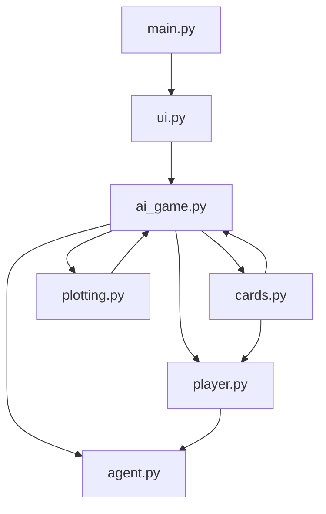

# Everdell AI - Software Description

## Project Overview

The Everdell AI project is a reinforcement learning-based artificial intelligence system designed to play the board game Everdell. The AI trains through self-play using a Q-learning algorithm and can be used to recommend optimal moves during actual gameplay. The system includes a user interface for training and testing the AI, as well as visualization tools for analyzing AI performance.

## Project Structure

### Key Files and Their Purposes

- **main.py**: Entry point of the application that initializes the UI
- **ui.py**: Implements the user interface for training and testing the AI
- **ai_game.py**: Contains the game logic, state management, and training process
- **agent.py**: Implements the reinforcement learning agent with Q-learning
- **player.py**: Extends the agent with game-specific actions and decision-making
- **cards.py**: Defines the card system, card types, and card effects
- **plotting.py**: Provides visualization tools for analyzing AI performance
- **requirements.txt**: Lists the required Python packages
- **ai_model.pkl**: Saved model file for the trained AI

## Major Components

### 1. Reinforcement Learning AI System

The AI system uses Q-learning, a model-free reinforcement learning algorithm, to learn optimal strategies through self-play. The system consists of:

- **Base Agent (agent.py)**: Implements the core Q-learning algorithm, including state representation, action selection, and learning mechanisms
- **Game-Specific Agent (player.py)**: Extends the base agent with game-specific actions and decision-making processes

Key features:
- State representation using numerical game state
- Epsilon-greedy exploration strategy with decay
- Experience-based learning with TD-error minimization
- Model saving and loading capabilities

For detailed information, see [AI System Description](ai-system-description.md).

### 2. Game Engine

The game engine (ai_game.py) manages the game state, enforces rules, and facilitates the training process. It includes:

- **Game State Management**: Tracks resources, cards, workers, and other game elements
- **Turn Structure**: Manages the sequence of player actions and game progression
- **Training Process**: Coordinates episodes, rewards, and learning updates
- **Testing Mode**: Allows for model evaluation and user interaction

Key features:
- Implementation of core Everdell game mechanics
- Support for 1-4 players
- Customizable training parameters
- Detailed performance tracking

For detailed information, see [Game Mechanics Description](game-mechanics-description.md).

### 3. Card System

The card system (cards.py) defines the various cards in the game, their properties, and their effects. It includes:

- **Card Types**: Character, Construction, Prosperity, etc.
- **Card Effects**: Activation effects, trigger effects, and forest card effects
- **Card Interactions**: Rules for how cards interact with each other and the game state

Key features:
- Implementation of all base game cards
- Card effect system with activation and trigger mechanisms
- Support for unique and common cards
- Card color system for scoring and effects

For detailed information, see [Game Mechanics Description](game-mechanics-description.md).

### 4. User Interface

The user interface (ui.py) provides a graphical interface for training and testing the AI. It includes:

- **Training Interface**: Configuration options, progress display, and results visualization
- **Testing Interface**: Card selection, game state visualization, and AI recommendation display

Key features:
- Configuration of training parameters
- Real-time display of training progress
- Interactive testing mode
- Visualization of AI performance metrics

For detailed information, see [User Interface Description](user-interface-description.md).

### 5. Data Visualization

The data visualization system (plotting.py) provides tools for analyzing AI performance. It includes:

- **Live Plotting**: Real-time visualization of training metrics
- **Chart Selection**: Various charts for analyzing different aspects of AI performance

Key features:
- TD error visualization
- Score tracking
- Win rate analysis
- Card play frequency analysis
- Resource choice analysis

For detailed information, see [Data Visualization Description](data-visualization-description.md).

## Implementation Status

### Currently Implemented Features

- Recalling workers for each season
- Meadow card system
- Hand management
- Drawing cards in summer
- Card names, points, and costs
- 15 card city limit, including for the fool
- Unique card constraints
- Basic locations
- Prosperity cards
- Card effects for cards in play
- Forest locations (basic implementation with placeholder effects)

### Partially Implemented Features

- Forest locations (locations exist but AI state representation needs updating)
- Card effects (many effects implemented but with limitations)
- Card interactions (basic interactions implemented but with simplifications)

### Planned Features (V1)

- Card rules that add worker locations
- Card rules that activate when a card is played
- Special Events
- King card rules
- Haven and Journey mechanics
- Occupation and bonus occupations
- Occupation lock
- Open Destination cards
- Testing pause functionality
- Improved Undertaker card selection logic (currently uses first 3 cards from meadow)

### Future Improvements (V2)

- AI choice improvements for cards like Judge, Innkeeper, and Crane
- Gatherer-Harvester pair mechanics
- Extra forest locations for 4 players
- Hand limit management when donating cards
- Meadow replenishment logic
- Passed player restrictions
- Tiebreaker improvements
- Deck reshuffling
- Card counting strategy
- Chapel and Shepherd implementation

## Limitations and Constraints

- The AI currently makes some heuristic assumptions in complex decision scenarios
- The AI uses fixed strategies for cards like Undertaker, Judge, and Crane rather than making optimal choices
- The AI can "cheat" by seeing opponent hands in the state representation
- Limited support for expansions (base game only)
- Some edge cases in card interactions are not fully implemented
- Forest card effects are implemented as placeholders
- The AI currently prioritizes using Innkeepers over Judges or Cranes without strategic consideration

For a detailed list of requirements and implementation status, see [Requirements](1-requirements.md).